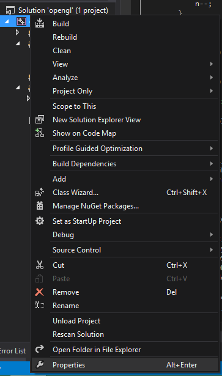
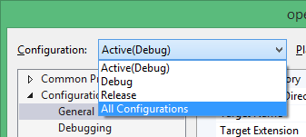
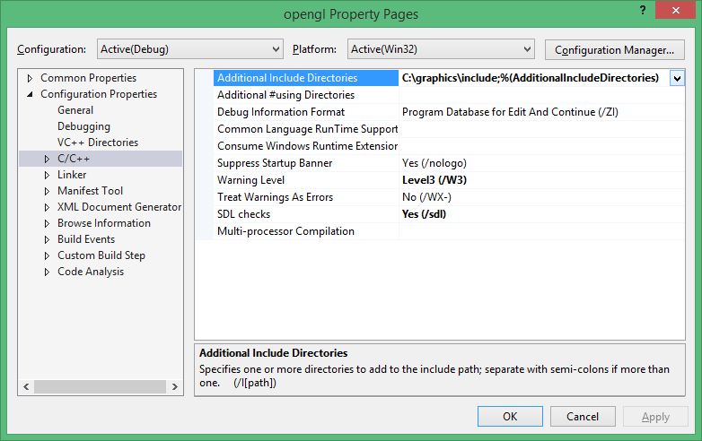
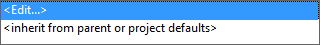
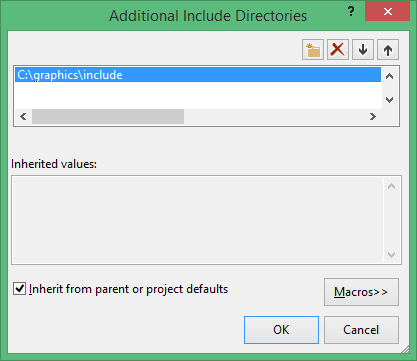
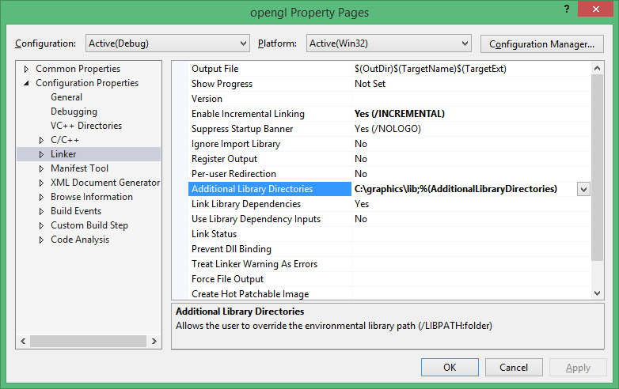
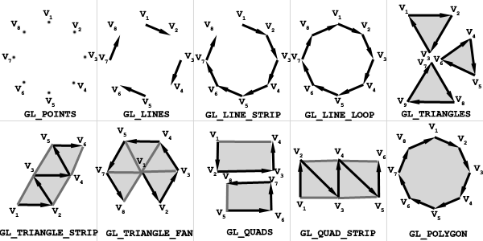
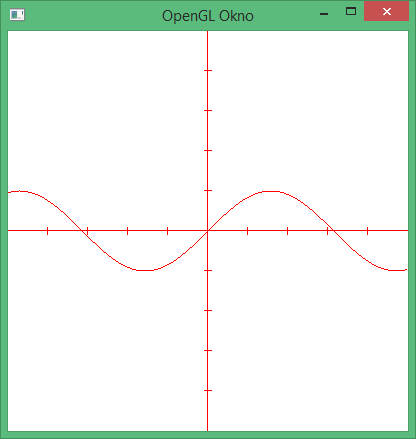

Open GL
===
Namestitev
----
*   Za uporabo s temi navodili boste potrebovali MS Visual studio, za ostale compilerje je potrebno uporabiti ostale precompiled headerje in librarije ali jih na novo scompilati
*   Prenesite knjižnjico iz tega [naslova](http://files.transmissionzero.co.uk/software/development/GLUT/freeglut-MSVC.zip)
*   Razširite preneseno datoteko
*   Ne glede na to, ali je sistem 32 ali 64 biten uporabite 32 bitne datoteke, da bo lahko aplikacija delovala v vseh okoljih
*   Iz mape bin kopiramo freeglut.bin v c:\windows\system
*   Iz mape Lib izbrišemo podmap x64
*   Ustvarimo mapo na c:\ z poljubnim imenom (npr. opengl)
*   Kopiramo celotni mapi include in lib v novo ustvarjeno mapo

Povezovanje v VISUAL Studiu
-------
*   Najprej ustvarimo nov projekt *C++ 32 console aplication*
*   Nato gremo v nastavitve projekta



*   V nastavitvah v configuration izbberemo All Configurations, da nam upošteva tudi za končno verzijo aplikacije



*   Navigiramo se v meni C/C++



*   Kliknemo na **Additional Include Directories** in izberemo *edit*



*   Nato izberemo pot do include mape (**!!Ne navigirajte še v mapo GL !!**)



*   Nato pojdite v meni Linker in v Additional Library Directories navigirajte v mapo *lib*



**Sedaj je vaš projekt pripravljen za programiranje**

Osnoven program
----
Na podlagi primera bom pripravil naš program za osnovno delovanje in možnost nadaljnega programiranja

```cpp
#include "stdafx.h"
//Če imate pravilno konfiguriran Visual studio, vam bo zaznalo ta include
#include <GL\freeglut.h>
//math.h nam bo prišla prav pri risanju grafov
#include <math.h>

//Funkcija za izrisovanje, ki se kliče na koncu vsakega izrisa
void render() {
    //Počistimo buffer z barvami, da lahko začnemo rendirati
    glClear(GL_COLOR_BUFFER_BIT);
    //Izberemo trenutno barvo s katero bomo risali
    glColor3f(0,0,0);

    //Sem pride risanje

    //Zaključimo cikel in kličemo ponoven izris
    glFlush();
    glutPostRedisplay();
}

//Funkcija za inicializacijo privzetih vrednost OpenGL
void init() {
    //Barva ozadja
    glClearColor(1, 1, 1, 1);
    //Povemo, da bomo delali v 2D
    glMatrixMode(GL_PROJECTION);
    glLoadIdentity();
    //Nastavimo delovno površino (levo, desno, spodaj, zgoraj, blizu, daleč)
    glOrtho(-5,5,-5,5,-1,1);
}

int _tmain(int argc, char** argv)
{
    //Inicializacija GLUTA
    glutInit(&argc, argv);
    //Nastavimo spremenljivke za OpenGL
    glutInitDisplayMode(GLUT_SINGLE | GLUT_RGB);
    //Povemo velikost okna z širino in višino
    glutInitWindowSize(400, 400);
    //Povemo pozicijo okna levo, desno
    glutInitWindowPosition(100, 100);
    //Povemo ime okna
    glutCreateWindow("OpenGL Okno");
    //Kličemo funkcijo za inicializacijo
    init();
    //Povmo, katera funkcija se uporablja za rendiranje
    glutDisplayFunc(render);
    //Zaženemo glavno zanko za OpenGL
    glutMainLoop();
    return 0;
}
```

Sestava funkcij OpenGL
-----

Funkcije v openglu so sestavljene iz predpone **gl** nato imena **Color**, številke parametrov **3** in številskega tipa **f** (float, double, int, ...)

Uporaba glBegin
-------
S to funkcijo povemo, kaj bomo risali na površino. Izbiramo lahko med več vrstami, vedno pa podajamo točke (vertexe)



Na voljo imamo:

*   **GL_POINTS** Izrisujejo se samo točke
*   **GL_LINES** Povežeta se po dve zaporedni točki
*   **GL_LINE_STRIP** Točke se povezujejo druga za drugo
*   **GL_LINE_LOOP** Podobno kot LINE_STRIP, stem da se zadnja točka poveže nazaj v prvo
*   **GL_TRIANGLES** Po tri točke se povezujejo v trikotnike
*   **GL_TRIANGLE STRIP** Vsaka nova točka se poveže s prejšnjima v trikotnik
*   **GL_TRIANGLE_FAN** Vsaka nova točka se poveže v prejšnjo in prvo ter tvori trikotnik
*   **GL_QUADS** Po štiri točke tvorijo štirikotnik
*   **GL_QUAD_STRIP** Vsaki nadaljni dve točki tvorita dodaten štirikotnik
*   **GL_POLYGON** Enako kot LINE_LOOP le da lik zapolni z izbrano barvo

Set točk vedno zaključimo z glEnd funkcijo.

Risanje Kvadrata
-----

Točke podamo v smeri urinega kazalca

```cpp
glBegin(GL_QUADS);
    glVertex2f(1, 1);
    glVertex2f(1, -1);
    glVertex2f(-1, -1);
    glVertex2f(-1, 1);
glEnd();
```

Risanje koordinatnega sistema
----
Za prikazovanje grafov moramo najprej narisati koordinatni sistem.

```cpp
//Risali bomo izključno črte, ki bodo črne barve
glColor3f(0,0,0);
glBegin(GL_LINES);
    //Najprej povežemo Skrajni točki na Y osi
    glVertex2d(0, 5);
    glVertex2d(0, -5);
    //Nato skrajni točki na X osi
    glVertex2d(-5, 0);
    glVertex2d(5, 0);
    //Potem z forom narišemo verikalne in horizontalne črte
    for (int i = -4; i < 5; i++) {
        //Narišemo jih z odmikom po x ali y osi za +/- 0.1
        glVertex2f(i, 0.1);
        glVertex2f(i, -0.1);
    }
    for (int i = -4; i < 5; i++) {
        glVertex2f(0.1, i);
        glVertex2f(-0.1, i);
    }
glEnd();
```

Izrisovanje poljubne funkcije
---
Najlažje je, da napišemo funkcijo, ki nam za poljuben X izračuna njegov Y.

```cpp
float izracun(float x) {
    return sin(x);
}
```

Nato pa narišemo pike ali črte, ki povzujejo točke med sabo

```cpp
glBegin(GL_LINE_STRIP);
    for (float i = -5; i < 5; i += 0.01)
        glVertex2f(i, izracun(i));
glEnd();
```

Dana funkcija nam izriše nekaj takega



Animacije
----
Ker OpenGL riše na površino vsak frame na novo, nam to omogoča enostavno animiranje. Če hočemo lahko pridobimo tudi časovni odmik csakega frama, da lahko sinhroniziramo izrisovanje ne glede na napravo.

V tem primeru bomo naredili kačo, ki gre po skrčeni sinusni krivulji, in se na koncu odbije. Določena bo s štirimi točkami točkami oddaljenimi za 0.2 glede na x os.

Najprej moramo inicializirati globalni spremenljivki. Prva bo štela trenutno pozicijo, druga pa smer;

```cpp
float pozicija = -5; //Začnemo na začetku
int smer = 1; //uporabljen za množenje
float hitrost = 0.0001;
```
        
Nato napišemo funkcijo za risanje krivulje

```cpp
float izracun(float x) {
    return sin(x * 2) * 2;
}
```

Nato v funkcijo render vključimo risanje kače:

```cpp
glBegin(GL_LINE_STRIP);
    //Zanka se izvede 4-krat
    for(float i = 0; i < 0.8; i+=0.2)
        glVertex2f(pozicija - i, izracun(pozicija - i)); //Narišemo štiri točke, od trenutne pozicije do 0.6 za našo točko
glEnd();
```   
             
Na koncu še preverimo če smo izven mej in spremenimo lokacijo

```cpp
if(pozicija > 5) {
    smer = -1; //Obrnemo smer
}
else if(pozicija < -5) {
    smer = 1; //
}
pozicija += smer * hitrost;
```
